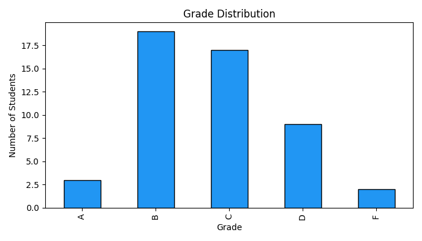
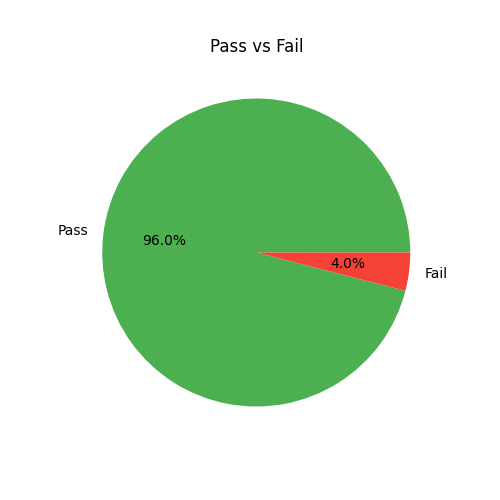
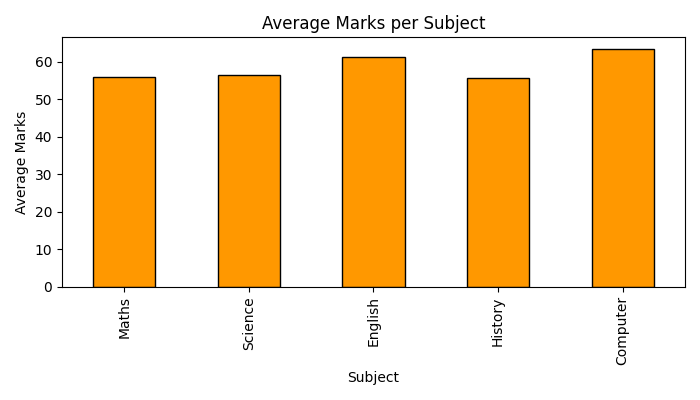
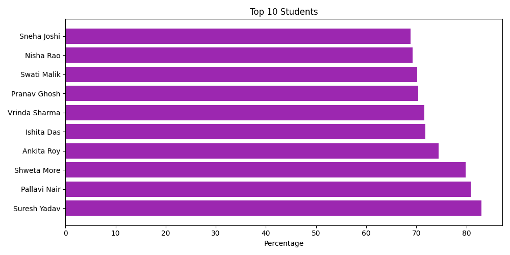
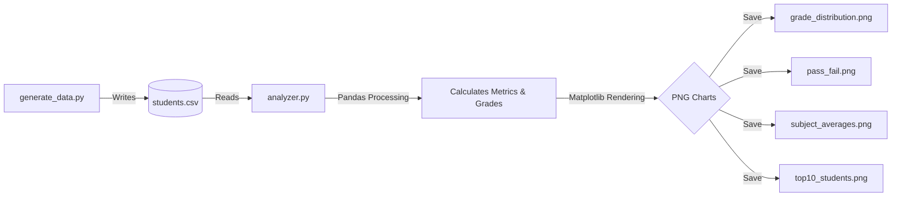

# 📊 Student Result Analyzer — Academic Data Pipeline

A Python-based data analysis pipeline that automatically generates structured student record datasets and compiles publication-quality analytical charts and performance statistics.

---

## 📸 Sample Visual Reports

The pipeline processes academic metrics and generates four distinct visual charts:

### Grade Distribution


### Pass vs Fail Ratio


### Subject Averages


### Top 10 Performers


---

## ✨ Features

* **Deterministic Mock Data Engine**: Generates a realistic academic dataset of 50 students across 5 subjects with configurable seed ranges (`random.seed(42)`) to ensure reproducible runs.
* **Statistical Insights Engine**: Computes total marks, subject percentages, letter grade profiles, pass/fail status, and top 5/10 class performers.
* **Vector Chart Export**: Auto-generates and saves high-resolution charts as optimized PNG files using Matplotlib.
* **Console Reporting**: Outputs a cleanly aligned ASCII terminal report showing averages and distributions.
* **Modular Codebase**: Decouples data generation logic (`generate_data.py`) from the analysis/visualization pipeline (`analyzer.py`).

---

## 🧰 Tech Stack

* **Language**: Python 3.12+
* **Data Processing**: Pandas (DataFrames, aggregations, filtering)
* **Visualization**: Matplotlib (custom chart layouts, labels, figure management)

---

## 🏗️ System Architecture



---

## 📦 How to Run

### Prerequisites
* Python 3.x installed on your machine.

### Setup Instructions

1. **Clone the Repository**
   ```bash
   git clone https://github.com/vijaybarhate/student-result-analyzer.git
   cd student-result-analyzer
   ```

2. **Install Dependencies**
   ```bash
   pip install pandas matplotlib
   ```

3. **Generate Dataset**
   Run the generator script to create the `students.csv` file:
   ```bash
   python generate_data.py
   ```

4. **Execute Analysis**
   Run the analysis script to print the summary report and render the chart images:
   ```bash
   python analyzer.py
   ```
   *The generated images will be saved inside the `output/` directory.*

---

## 🧠 Challenges Faced

* **Deterministic Simulation**: Creating random marks that feel realistic (not just pure flat random distributions) required adjusting seed configurations. Setting realistic bounds for subjects (e.g. computer and science scoring higher on average than history) helped mirror real student populations.
* **Resource Cleanup in Plotting**: Running multiple Matplotlib chart generations in a single execution script can cause memory leaks. We resolved this by explicitly calling `plt.close()` after every save operation to flush the backend graphic canvases.
* **Windows Console Compatibility**: Printing Unicode emojis to the standard Windows Command Prompt (CP1252 default encoding) throws a decoding exception. We resolved this in our execution scripts by configuring the execution environment with `PYTHONIOENCODING=utf-8` to enforce safe output printing.

---

## 🔮 Future Improvements

- [ ] **Jupyter Notebook Integration**: Add an interactive `.ipynb` notebook showing inline step-by-step Pandas operations.
- [ ] **Advanced Analytics**: Integrate correlation maps to analyze whether a student's performance in one subject (e.g., Maths) correlates with others (e.g., Computer Science).
- [ ] **PDF Automated Export**: Integrate `ReportLab` to compile the statistics and chart outputs into a single downloadable PDF report.

---

Built with 🖤 by [Vijay Barhate](https://github.com/vijaybarhate)
